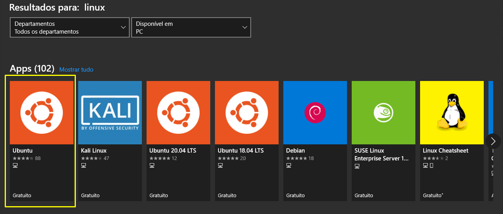
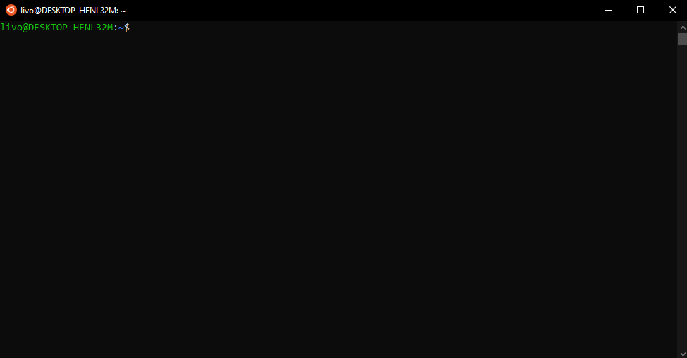
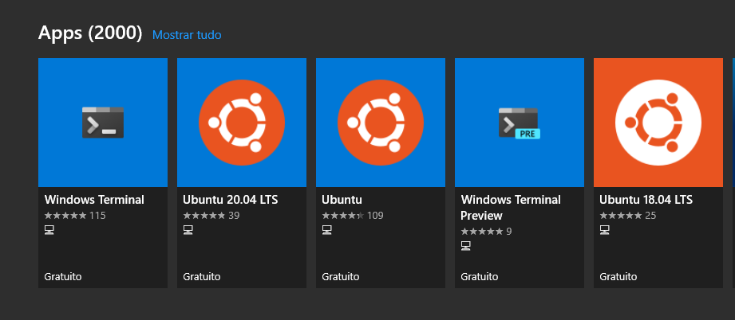
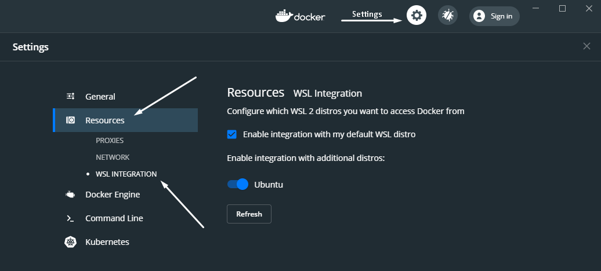
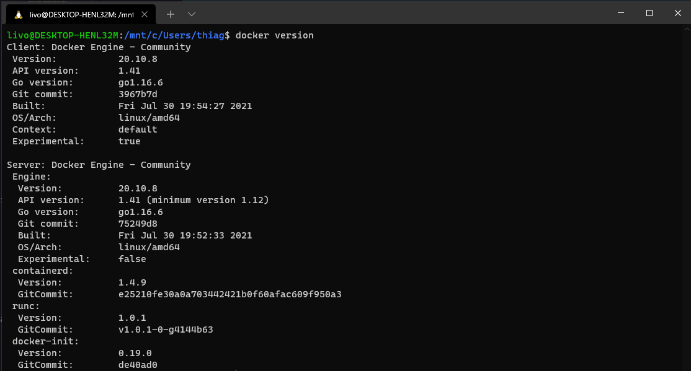

# Guia rápido instalação do WSL2 + Docker

## Requisitos mínimos

- Windows 10 Home ou Professional.

- Versão do Windows (Pode ser que seu Windows 10 já seja igual ou superior a 20.04, verifique isto    acessando o menu de notificações perto do relógio > Todas as configurações > Sistema > Sobre.):
  - Para sistemas x64: Versão 1903 ou superiores, com o Build 18362 ou superiores.
  - Para sistemas ARM64: Versão 2004 ou superiores, com o Build 19041 ou superiores.
  - Os builds inferiores a 18362 não dão suporte a WSL 2.

- Uma máquina compatível com virtualização (verifique a disponibilidade de acordo com a marca do seu  processador. Se sua máquina for mais antiga pode ser necessária habilita-la na BIOS).
  - Ativar em recursos do windows: **Plataforma de Máquina Virtual**

- Pelo menos 4GB de memória RAM.

---

## Passo 1 - Habilite o WSL no Windows 10

Execute os seguintes comandos no PowerShell em modo administrador:
``` bash
dism.exe /online /enable-feature /featurename:Microsoft-Windows-Subsystem-Linux /all /norestart
dism.exe /online /enable-feature /featurename:VirtualMachinePlatform /all /norestart
```
Abra o PowerShell e digite o comando `wsl`, se não funcionar reinicie sua máquina.

---

## Passo 2 - Instale o WSL 2 no Windows 10

Baixe o Kernel do WSL 2 neste link: [https://docs.microsoft.com/pt-br/windows/wsl/wsl2-kernel](https://docs.microsoft.com/pt-br/windows/wsl/wsl2-kernel) e instale o pacote.  


### (Opcional) Alterar a versão do WSL 1 de uma distribuição para a versão 2

Se você já tiver o WSL 1 na máquina e acabou de instalar a versão 2, pode-se converter sua distribuição Linux WSL 1 para WSL 2, execute o comando com o PowerShell:

``` bash
wsl --set-version <distribution name> 2
```

**Isto pode demorar muitos minutos.**

---   


## Passo 3 - Atribua a versão default do WSL para a versão 2

A versão 1 do WSL é a padrão no momento, atribua a versão default para a versão 2, assim todas as distribuições Linux instaladas serão já por default da versão 2. Execute o comando com o PowerShell:

``` bash
wsl --set-default-version 2
```

--- 

### Passo 4 - Escolha sua distribuição Linux no Windows Store

Escolha sua distribuição Linux preferida no aplicativo Windows Store, sugerimos o Ubuntu por ser uma distribuição popular e que já vem com várias ferramentas instaladas por padrão.



Ao iniciar o Linux instalado, você deverá criar um **nome de usuário** que poderá ser o mesmo da sua máquina e uma **senha**, este será o usuário **root da sua instância WSL**.

Parabéns, seu WSL2 já está funcionando:



--- 

## (opcional) Usar Windows Terminal como o terminal padrão de desenvolvimento para Windows

Instale-o pelo Windows Store para habilitar WSL 2, Git Bash e outros shells.




---

## Instalar e integrar Docker com WSL 2


- Baixe neste link: https://hub.docker.com/editions/community/docker-ce-desktop-windows e instale o Docker Desktop.


- Clique no ícone do Docker perto do relógio do windows, depois em: `Settings -> Settings no topo -> Resource`.

  - Habilite `Enable integration with my default WSL distro` e habilite sua versão Linux.  

    

Pronto, seu docker já estará integrado com o WSL 2



---


## O que o WSL 2 pode usar de recursos da sua máquina

Podemos dizer que o WSL 2 tem acesso quase que total ao recursos de sua máquina. Ele tem acesso por padrão:

* A todo disco rígido.
* A usar completamente os recursos de processamento.
* A usar 80% da memória RAM disponível.
* A usar 25% da memória disponível para SWAP.

Isto pode não ser interessante, uma vez que o WSL 2 pode usar praticamente todos os recursos de sua máquina, mas podemos configurar limites.

Crie um arquivo chamado `.wslconfig` na raiz da sua pasta de usuário `(C:\Users\<seu_usuario>)` e defina estas configurações:

```txt
[wsl2]
memory=8GB 
processors=4
swap=2GB
```

Estes são limites de exemplo.

Para aplicar estas configurações é necessário reiniciar as distribuições Linux, então sugerimos executar no PowerShell o comando: `wsl --shutdown` (Este comando vai desligar todas as instâncias WSL 2 ativas e basta abrir o terminal novamente para usa-la já com as novas configurações).

